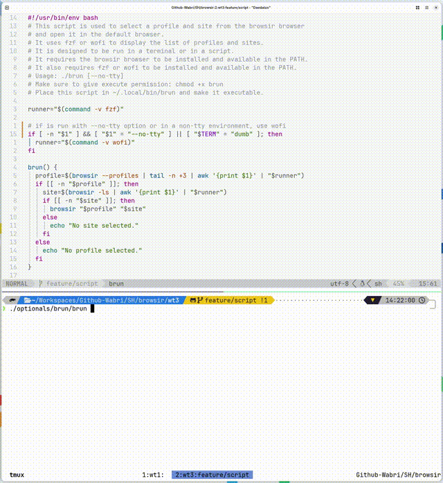

## BRUN

Run browsir with [wofi](https://github.com/SimplyCEO/wofi) launcher or [fzf](https://github.com/junegunn/fzf) fuzzy finder.

The script will list all the bookmarks in your `browsir` database and allow you to select one to open in your browser.

The script will recognize if you are running in a terminal or a graphical environment and will use `wofi` or `fzf` accordingly. Or you can force it to use `wofi` or `fzf` by passing the `--no-tty` option.

## Screenshot



## Installation

```bash
mkdir -p ~/.local/bin
mv brun $HOME/.local/bin/brun
chmod +x $HOME/.local/bin/brun
```

## Usage

```bash
brun [--no-tty]
```

## Dependencies

- [wofi](https://github.com/SimplyCEO/wofi) or [fzf](https://github.com/junegunn/fzf)
- [browsir](https://github.com/Schroedinger-Hat/browsir)
